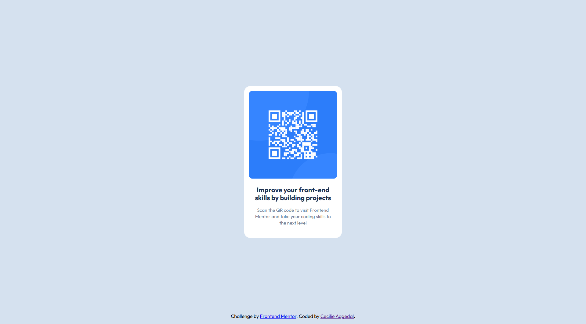

# Frontend Mentor - QR code component solution

This is a solution to the [QR code component challenge on Frontend Mentor](https://www.frontendmentor.io/challenges/qr-code-component-iux_sIO_H). Frontend Mentor challenges help you improve your coding skills by building realistic projects. 

## Table of contents

- [Overview](#overview)
  - [Screenshot](#screenshot)
  - [Links](#links)
- [My process](#my-process)
  - [Built with](#built-with)
  - [What I learned](#what-i-learned)
  - [Continued development](#continued-development)
  - [Useful resources](#useful-resources)
- [Author](#author)
- [Acknowledgments](#acknowledgments)

**Note: Delete this note and update the table of contents based on what sections you keep.**

## Overview

### Screenshot

### Links

- Solution URL: [Cecilie's solution](https://github.com/caagedal/QR-component)
- Live Site URL: [ gitHub pages live solution](https://caagedal.github.io/QR-component/)

## My process

- viewed the design files
- added HTML first
- added css
- deployed to gitHub pages

### Built with

- Semantic HTML5 markup
- CSS custom properties
- Flexbox
- google fonts

### What I learned

I am overcomplicating the code at times. I could've made the code cleaner and simpler, less css.

### Continued development

Simplify my css and html. 

## Author

- Frontend Mentor - [@caagedal](https://www.frontendmentor.io/profile/caagedal)

